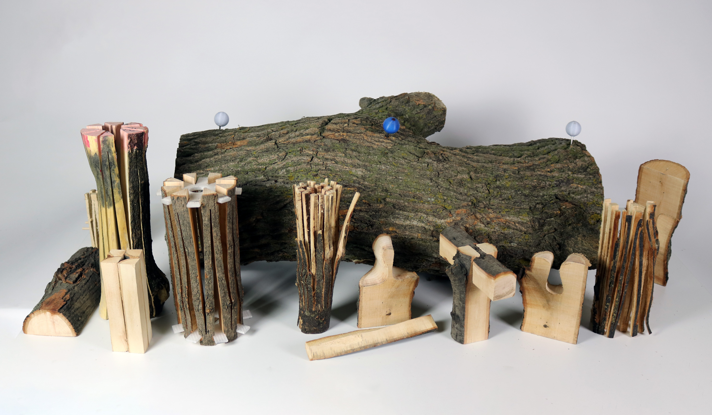
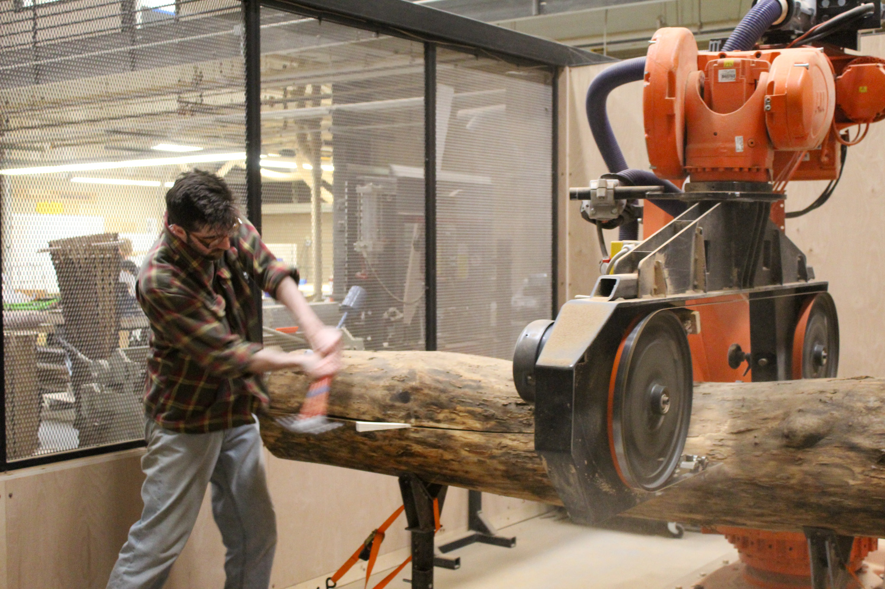

# Stickbug

## Roundtimber Robotics and 6 axis Toolpath Generation

**This Grasshopper plugin was developed as a teaching tool for a digital design and fabrication elective course at the IIT School of Architecture in Chicago, focusing on the innovative use of non-standard round-timber elements through 6-axis robotic fabrication.** 

*Student work from IIT School of Architecture using Stickbug plugin*

Stickbug serves as a means to quickly analyze 3D mesh scans of logs in order to derive information such as centerlines, estimated internal pith location, forked branch locations, 3D branching angle data, amount of crook in a log, etc. It has additional components to orient and scale geometries to align the robot's real world coordinate system to the digital object.

The plugin also aims to optimize and simplify the creation of 6-axis robotic toolpaths through the use of planar and non-planar curves combined with orientation data in a number of forms, depending on the context. Orientation data is embedded in the toolpath through the use of planes, which can be fed directly into a number of robotic kinematics plugins (KUKAprc, ABBRobotComponents, etc.).

Additional components assist with student workflow concerns and simple unit system conversion. Please email me if you find any issues.

Special thanks to the Director of the Decon/Recon Lab, Dillon Pranger, for co-teaching this course with me and helping build out the functionality of this plugin, and Sarah Grunert for assisting with graphic design, as well as all the 'Arch 492 Logging//Logging' students for being the guinea pigs in the development of this tool.

[**Download on Food4Rhino**](https://www.food4rhino.com/en/app/stickbug)

*Author using Stickbug*
